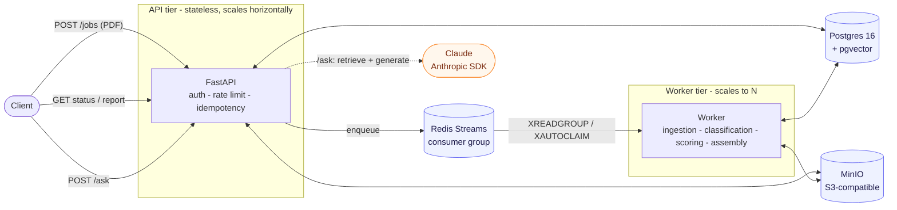
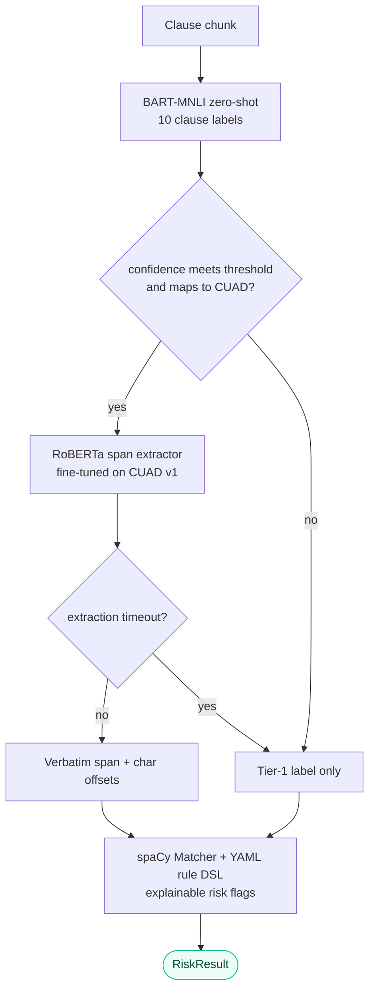
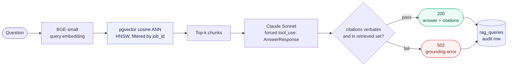
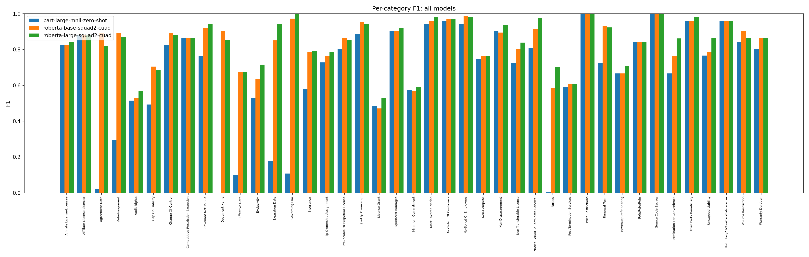

<div align="center">

# Verity

**Fault-Tolerant Contract-Risk Pipeline with Grounded RAG and LLM-as-Judge Evals**

[](https://github.com/danielhansenjones/verity/actions/workflows/ci.yml)
[](#results)
[](#results)
[](#results)
[](#results)

[](pyproject.toml)
[](https://fastapi.tiangolo.com/)
[](https://redis.io/docs/latest/develop/data-types/streams/)
[](https://github.com/pgvector/pgvector)
[](https://huggingface.co/)
[](https://www.anthropic.com/)
[](https://min.io/)
[](docker-compose.yml)

</div>

A distributed document processing pipeline built on Redis Streams, PostgreSQL, and MinIO.
Accepts PDF uploads over a hardened REST API, queues jobs for async worker processing, and returns structured risk reports from a two-tier ML cascade:
BART-MNLI zero-shot clause classification feeding into fine-tuned RoBERTa span extraction on flagged clauses, with rule-based risk flags and verbatim evidence spans.

Legal contract review is slow and expensive.
Lawyers spend time locating clauses that a well-built system can classify and flag in seconds.
This pipeline handles that pre-screening layer: classify every clause, match risk patterns with exact character offsets, and extract verbatim spans from flagged sections using a model trained on 500 real contracts.
The goal is to automate the repetitive part and surface structured evidence so that review is faster and more consistent.
The judgment on what to negotiate stays with the lawyer.

## Highlights

A few flagship properties up front; grouped detail below is collapsed to keep this scannable.

- **At-least-once delivery** with crash recovery: Redis Streams consumer groups plus `XAUTOCLAIM` reclaim of dead workers. No in-flight job is silently lost.
- **Two-tier ML cascade** lifts span-extraction trimmed macro F1 from 0.41 (zero-shot) to 0.73 (fine-tuned base).
- **Grounded RAG**: a post-generation citation check rejects fabricated quotes or chunk ids with `502`.

<details>
<summary><b>Reliability and delivery</b> - idempotency, stage-checkpointed retries</summary>

- **At-least-once delivery** via Redis Streams consumer groups. Jobs stay in the pending-entries list until `XACK`. Crashed workers are reclaimed by `XAUTOCLAIM` after a configurable idle threshold; no in-flight job is silently lost.
- **Idempotent `POST /jobs`** with client-supplied or content-hash dedup keys. Concurrent first-time submissions race at the DB layer via a unique constraint; the loser returns the winner's `job_id` with `Idempotent-Replay: true`.
- **Stage-checkpointed retries.** The worker persists which pipeline stage completed before a failure. A retry resumes from the last successful stage; a transient scoring error does not re-run ingestion or classification.

</details>

<details>
<summary><b>API hardening</b> - timing-safe auth, pre-parse upload caps, rate limits</summary>

- **Hardened API layer.** Timing-safe key auth (`hmac.compare_digest`), pre-parse upload cap via middleware (411 and 413 before multipart parsing is attempted), and per-IP rate limits with `Retry-After`.

</details>

<details>
<summary><b>Observability and load</b> - Prometheus on both tiers, Locust results</summary>

- **Prometheus metrics on both tiers.** API and worker each expose a scrape target. Tracked series: submissions, completions, per-stage duration histograms, per-stage error counts, and queue depth.
- **Empirically validated under Locust.** 9.6 jobs/min sustained at one worker, submit p50 14ms under load and 62ms under a 20 VU spike, zero server errors across both. Rate limiting fires with `Retry-After`; span extractor timeout degrades to tier-1 labels without failing the job.

</details>

<details>
<summary><b>ML cascade</b> - BART-MNLI zero-shot into fine-tuned RoBERTa span extraction</summary>

- **Cascade ML pipeline.** BART-MNLI zero-shot classifies a clause type across 10 labels. A fine-tuned RoBERTa model trained on CUAD v1 extracts verbatim spans when tier-1 confidence meets the threshold and the clause maps to a CUAD category. Trimmed macro F1 goes from 0.41 (zero-shot) to 0.73 (fine-tuned base). A spaCy `Matcher` and YAML rule DSL layer produces explainable risk flags with exact character offsets. Per-chunk extraction timeout falls back to tier-1 without failing the job.

</details>

<details>
<summary><b>RAG and evals</b> - grounded citations, audit log, LLM-as-judge harness</summary>

- **RAG query endpoint with verified citations.** `POST /jobs/{id}/ask` runs free-text questions against the contract's chunks. Local BGE-small embeddings stored in a pgvector column on Postgres, cosine-similarity retrieval, Claude generation with structured outputs, and a post-generation grounding check that rejects fabricated quotes or chunk ids with `502`. The deterministic pipeline remains fully functional without this endpoint.
- **Auditable RAG calls.** Every `/ask` is persisted to a `rag_queries` table: the question, ordered retrieved chunk ids, answer, citations, token usage, retrieval and generation latency, and the terminal outcome (answered, refused, or error with the grounding failure). Storing chunk ids rather than text reconstructs the exact prompt for any past call, since chunks are immutable. Writes are best-effort and never fail a good answer.
- **Hand-rolled RAG eval harness with LLM-as-judge.** 30-case dataset scored across faithfulness, citation accuracy, completeness, and refusal correctness. Judge model (`claude-haiku-4-5`) is deliberately different from the generator (`claude-sonnet-4-6`) to reduce self-grading bias. First-run aggregate 0.967 / 1.000 / 0.967 / 1.000 with multi-clause synthesis as the documented soft spot at 0.833 faithfulness. CI re-runs a frozen subset on PRs touching the RAG surface.

</details>

<details>
<summary><b>Testing and ops</b> - 169 tests, single-command stack</summary>

- **169 tests** covering API contracts, pipeline stages, queue semantics, auth, rate limits, idempotency, upload sizing, span extraction, timeout fallback, embeddings, citation grounding, and the RAG endpoint.
- **Single-command local stack** via Docker Compose (Postgres+pgvector, Redis, MinIO, API, worker).

</details>

## Architecture

Four tiers, deliberately separated. Each scales, fails, and deploys independently.



### Two-tier ML cascade

A cheap zero-shot classifier gates an expensive fine-tuned span extractor. Tier-2 only runs when tier-1 is confident and the clause maps to a CUAD category, and a per-chunk timeout degrades to the tier-1 label instead of failing the job.



### RAG query flow (POST /ask)

Every answer passes a grounding gate before it leaves the box: cited quotes must be verbatim substrings of retrieved chunks and cited ids must be in the retrieved set, or the request 502s. Each call is persisted to an audit table.



## Results

| Metric                              | Value                                                       |
|-------------------------------------|-------------------------------------------------------------|
| Span-extraction macro F1            | 0.41 zero-shot to 0.73 fine-tuned (RoBERTa-base on CUAD v1) |
| RAG faithfulness (LLM-as-judge)     | 0.967                                                       |
| Citation accuracy                   | 1.000                                                       |
| Completeness / refusal correctness  | 0.967 / 1.000                                               |
| Throughput, single worker           | 9.6 jobs/min                                                |
| Submit latency p50                  | 14 ms (62 ms under a 20 VU spike)                           |
| Server errors under load            | 0                                                           |
| Tests                               | 169                                                         |



*Per-category F1 across all 41 CUAD categories. Blue is BART-MNLI zero-shot; orange and green are fine-tuned RoBERTa (base and large). Fine-tuning closes the largest gaps on categories zero-shot barely handles (Anti-Assignment, Effective Date, Governing Law, Expiration Date).*

RAG eval is a 30-case dataset scored by an LLM judge (`claude-haiku-4-5`) that is deliberately different from the generator (`claude-sonnet-4-6`) to reduce self-grading bias. Multi-clause synthesis is the documented soft spot at 0.833 faithfulness. Full methodology is in [cuad/README.md](cuad/README.md).


## Stack

| Layer      | Technology                                | Purpose                                    |
|------------|-------------------------------------------|--------------------------------------------|
| API        | FastAPI                                   | Job submission, status, results, /ask      |
| Queue      | Redis Streams + consumer group            | At-least-once dispatch with crash recovery |
| Worker     | Python process                            | Pipeline execution                         |
| Database   | PostgreSQL + pgvector + SQLAlchemy        | Job state, chunks, embeddings, results     |
| Storage    | MinIO (S3-compatible)                     | Raw PDFs, report artifacts                 |
| ML         | HuggingFace Transformers                  | Clause classification + scoring            |
| Embeddings | sentence-transformers (BGE-small-en-v1.5) | 384-dim chunk + query embeddings           |
| RAG LLM    | Anthropic SDK (claude-sonnet-4-6)         | Structured answer + citation generation    |
| Container  | Docker Compose                            | Single-command local stack                 |

## Quick Start

```bash
cp .env.example .env
python scripts/run.py
```

Or directly via Docker:
```bash
docker compose up --build
```

| Service        | URL                        |
|----------------|----------------------------|
| API            | http://localhost:8000      |
| API docs       | http://localhost:8000/docs |
| MinIO console  | http://localhost:9001      |
| Postgres       | localhost:5432             |

**Set up the RAG endpoint backend (optional, only needed for `/ask`):**

Set `ANTHROPIC_API_KEY=sk-ant-...` in `.env`. Key from `console.anthropic.com` (separate from a Claude.ai subscription).

**Submit a job:**
```bash
curl -X POST http://localhost:8000/jobs \
  -F "file=@sample_contract.pdf"
```

**Check status:**
```bash
curl http://localhost:8000/jobs/{job_id}
```

**Get report:**
```bash
curl http://localhost:8000/jobs/{job_id}/report
```

**Seed sample jobs:**
```bash
docker compose exec api python tests/seed.py
```

## API

| Method | Route                   | Description                                                 |
|--------|-------------------------|-------------------------------------------------------------|
| POST   | `/jobs`                 | Upload PDF, enqueue job - returns `job_id`                  |
| GET    | `/jobs/{job_id}`        | Job status, stage, retry count, and error if any            |
| GET    | `/jobs/{job_id}/report` | Risk result + presigned MinIO URL for full report           |
| POST   | `/jobs/{job_id}/ask`    | Free-text question, returns answer + grounded citations     |
| GET    | `/jobs`                 | List recent jobs, optional `?status=` filter                |
| GET    | `/health`               | Postgres and Redis connectivity check                       |
| GET    | `/metrics`              | Prometheus exposition (public, unauthenticated)             |

`POST /jobs/{id}/ask` requires `ANTHROPIC_API_KEY` to be set; otherwise the endpoint returns `503`. The rest of the API works without it.

Auth, rate limits, idempotency semantics, full request/response shapes, and the pipeline internals are in [TECHNICAL.md](TECHNICAL.md).

### Audit log retention and sensitive data

The `rag_queries` table grows without bound: every `/ask` appends a row and nothing prunes them. Production deployments should set a retention window, 90 days is a reasonable default, and delete older rows on a schedule. That pruner is not part of this change.

Questions and stored answers can carry PII or commercially sensitive terms, written verbatim to `rag_queries.question` and `rag_queries.answer`. Deployments handling real contracts should enable Postgres encryption at rest, restrict the database role that can read this table to the principals that actually need audit access, and consider field-level redaction at write time if the exposure scope warrants it.

## CI

Three workflows run on push and pull request to `main`:

| Workflow     | Jobs                                                       |
|--------------|------------------------------------------------------------|
| `ci.yml`     | Flake8 lint, pytest                                        |
| `docker.yml` | Docker image build (validates the Dockerfile)              |
| `evals.yml`  | Frozen RAG eval subset, on PRs touching the RAG surface    |

## Pre-commit

```bash
pip install pre-commit
pre-commit install
```

Runs on every commit: Flake8 lint, trailing whitespace, EOF, YAML and TOML validation.

## Scripts

| Script              | Purpose                                    |
|---------------------|--------------------------------------------|
| `scripts/run.py`    | Start the full stack via Docker Compose    |
| `scripts/test.py`   | Run the pytest suite (no services needed)  |

Both are plain Python files. Point PyCharm's Run/Debug buttons directly at them.

## Deeper reading

- [TECHNICAL.md](TECHNICAL.md) - auth, limits, idempotency, metrics, pipeline stages, RAG layer, architecture and scaling numbers, CUAD v2 cascade, project structure, fault tolerance, design decisions.
- [cuad/README.md](cuad/README.md) - CUAD training hyperparameters, data split methodology, per-category F1 results.
